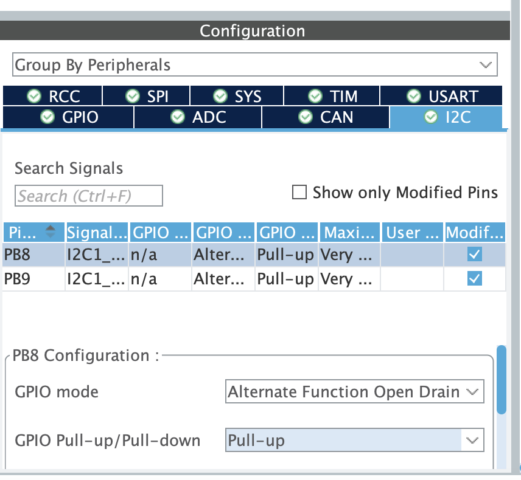
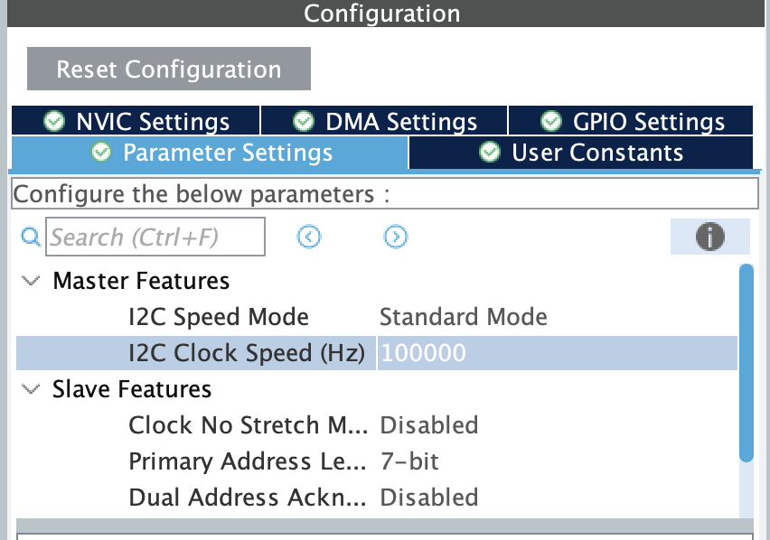

# 2025 RDC TOF Library

Compact helper library and documentation for using ST VL53L1x Time-of-Flight (ToF) sensors on the RDC platform. This repo wraps the ST VL53L1 API to make it easy to run multiple sensors on a single I²C bus by using the XSHUT pin to power-cycle and re-address each module.

## Files and layout

The `ToF_Library` folder contains:

- `readme.md` — this document
- `vl53l1_API/` — ST-provided VL53L1 API sources and headers
- `vl53l1_platform.c` / `vl53l1_platform.h` — platform glue (I²C read/write, delays, GPIO helpers)
- `vl53l1_types.h` — types used by the ST API
- `tof_vl53l1.c` / `tof_vl53l1.h` — helper layer that manages multiple sensors and provides an easy device struct

See the source files for exact symbol names and prototypes.

## Purpose

This helper layer provides:

- A device struct (`tof_vl53l1_dev_t`) containing useful fields: I²C address, distance (mm), signal/ambient rates, SPAD count, range status, and a field (`status`) that stores the last VL53L1 API return code for debugging.
- An init routine (`tof_vl53l1_init`) that:
  - uses a GPIO connected to each module's XSHUT pin to power modules on/off,
  - scans the I²C bus to detect a newly powered module,
  - programs a new I²C address for that module,
  - configures sensor timing and modes.
- Simple read helpers to obtain a single measurement.

## Device struct (summary)

The device struct in `tof_vl53l1.h` looks like:

```c
typedef struct tof_vl53l1_dev{
    int status;              // last VL53L1 API return value
    uint16_t I2cDevAddr;     // current I2C address
    uint8_t orgAddr;         // original/default address
    uint8_t Model_ID;
    uint8_t Module_Type;
    uint16_t ID;
    uint16_t Distance;       // last measured distance (mm)
    uint16_t SignalRate;
    uint16_t AmbientRate;
    uint16_t SpadNum;
    uint8_t RangeStatus;
    uint8_t dataReady;
    GPIO_TypeDef *gpio_port; // XSHUT GPIO port
    uint16_t gpio_pin;       // XSHUT GPIO pin
} tof_vl53l1_dev_t;

int tof_vl53l1_init(tof_vl53l1_dev_t *dev, uint16_t i2c_addr, uint8_t mode, uint8_t timing_budget, uint8_t inter_measurement_time, GPIO_TypeDef *gpio_port, uint16_t gpio_pin);
```

Read the header for the full API and prototypes.

## How multi-sensor initialization works (concept)

All VL53L1x modules ship with the same default I²C address. To use multiple modules on one bus you must:

1. Connect each module's XSHUT pin to a separate MCU GPIO.
2. Drive ALL XSHUT pins LOW at startup (keeps modules disabled).
3. For each sensor you want to enable:
   - Drive that sensor's XSHUT HIGH (power it on).
   - Call `tof_vl53l1_init(&dev, desired_i2c_addr, ...)` which:
     - scans the I²C bus to find the newly powered device,
     - programs the requested `desired_i2c_addr` into that device,
     - waits for the device to boot (the init routine polls boot state),
     - applies the requested timing budget / inter-measurement settings.

Notes:
- The init routine stores the last VL53L1 API return in `dev->status` for debugging.
- The boot-state poll is intentionally blocking to ensure the sensor is ready before continuing; wiring or incorrect XSHUT control can cause a hang here.

## Init pipeline (detailed)

This library's `tof_vl53l1_init` follows a simple pipeline to support multiple VL53L1x modules on one I²C bus. I preserved the original flow here and cleaned up the wording — keep these steps in mind when wiring and debugging:

1. Ensure ALL XSHUT pins are driven LOW so every sensor is held in reset.
2. For the sensor you want to configure now:
   - Drive that sensor's XSHUT HIGH (power it on).
   - The init routine scans the I²C bus to detect the newly powered device. The implementation loops over 7-bit addresses and treats the first responsive device as the newly powered unit (this is why you should pick new addresses > default and < 0x7F).
   - The code programs the requested new I²C address into the device using the VL53L1 API.
   - The routine polls the device boot state until the sensor responds. This is intentionally blocking to avoid racing the rest of the system. Example polling snippet used in the library:
        ```c
        uint8_t sensorState = 0;
        while (sensorState == 0) {
            dev->status = VL53L1X_BootState(dev->I2cDevAddr, &sensorState);
            HAL_Delay(2);
        }
        ```

   - After boot completes, the init function configures the timing budget, inter-measurement interval, and other sensor settings.
3. On success the function returns 0 and `dev->status` contains the last API call status; on failure the calling code can inspect `dev->status` for a VL53L1 API error code.

Notes on the scan/address step: the implementation chooses the first responsive address during the scan as the newly powered device. This approach works reliably if only a single module was released from reset. If multiple modules share power or a different device is present, the scan may pick the wrong device — keep wiring disciplined and pick unique target addresses.

## I²C configuration (important)
When you initialize the I²C peripheral for use with these modules, keep these platform constraints in mind:

1. The board does not provide external pull-up resistors on the SDA/SCL lines. Use the MCU's internal pull-ups (configure them on the SDA/SCL pins) or add appropriate external pull-ups.
   
2. The internal pull-ups on many MCUs are relatively weak. If you rely on internal pull-ups prefer a lower bus speed — the codebase recommends keeping I²C < 10 kHz when using internal pull-ups only.
   
   > Noted that the frequency number here is not the one we want
3. Make sure the HAL I2C instance you enable is the same one referenced by the library (the `vl53l1_hi2c` handle inside `tof_vl53l1.c`). If you change the I2C peripheral used by your board, update that handle.

## Example usage (multiple sensors)

Minimal example showing one sensor being turned on and initialized. Adapt GPIO names and addresses for your board.

```c
// example_usage.c (fragment)
tof_vl53l1_dev_t dev1;
// Ensure all XSHUT pins are LOW at startup
HAL_GPIO_WritePin(TOF1_XSHUT_PORT, TOF1_XSHUT_PIN, GPIO_PIN_RESET); 
// Start init
int res = tof_vl53l1_init(&dev1, 0x54, /*mode*/0, /*timing_budget_ms*/33, /*inter_ms*/50, TOF1_XSHUT_PORT, TOF1_XSHUT_PIN);
if (res != 0) {
    // check dev1.status for the last API error
}

// Inside your main while loop
int sample_res = tof_regular_sample(dev1);
// Get the sample result from your dev1
```

If you only have a single VL53L1x on the bus, you may call the ST API directly (e.g. `VL53L1X_SensorInit`) with the default address and skip the XSHUT readdressing dance.

Then you also no need to set the XSHUT pin in this case.

