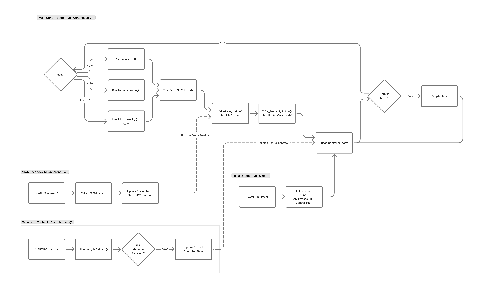

# RDC Project - Group Won-Won

This repository contains the complete codebase for the "Won-Won" robot. The system is built around an STM32 microcontroller and features a 3-wheel omni-drive base, a pneumatic actuator, and a Time-of-Flight (ToF) sensor. The robot can be operated manually via a Bluetooth-connected gamepad or run a predefined autonomous sequence.

## System Architecture

The project is divided into two main components: the embedded firmware for the robot's microcontroller and a host-side Python application for remote control and monitoring.

1.  **Embedded System (STM32F405):** The bare-metal firmware running on the robot. It is responsible for all real-time tasks, including motor control, sensor processing, and command execution.
2.  **Host Controller Application (PC):** A Python-based GUI application that runs on a computer. It reads input from a connected gamepad, sends control commands to the robot over Bluetooth, and displays telemetry data received from the robot.



## Features

*   **Holonomic Movement:** 3-wheel omni-directional drive base allows for movement in any direction.
*   **Dual Control Modes:** Switch between manual (gamepad) and autonomous operation.
*   **Wireless Communication:** Bluetooth (UART) for robust, non-blocking communication with the host application.
*   **Sensor Integration:** Includes a VL53L1X Time-of-Flight sensor for distance measurement.
*   **Actuator Control:** Manages a pneumatic arm for task-specific actions.
*   **Real-time Feedback:** A double-buffered TFT LCD displays on-robot status, while the host application provides detailed telemetry.
*   **Configurable Autonomy:** Autonomous sequences are defined in a simple JSON file (`scripts/autonomous_sequence.json`).

## Hardware and Peripheral Configuration

The firmware is configured using STM32CubeMX (`2025-sw-tutorial-v3.1.ioc`). Key peripherals and their pinouts are as follows:

| Peripheral | Instance | Pins                                | Purpose                                   |
| :--------- | :------- | :---------------------------------- | :---------------------------------------- |
| **CAN**    | `CAN1`   | `PA11` (RX), `PA12` (TX)            | Motor control and feedback (Drive Base)   |
|            | `CAN2`   | `PB12` (RX), `PB13` (TX)            | Motor control and feedback (Drive Base)   |
| **UART**   | `USART1` | `PA9` (TX), `PA10` (RX)             | Bluetooth Communication                   |
| **SPI**    | `SPI1`   | `PA5` (SCK), `PA7` (MOSI)           | TFT LCD Display                           |
| **I²C**    | `I2C2`   | `PB10` (SCL), `PB11` (SDA)          | VL53L1X Time-of-Flight Sensor             |
| **GPIO**   | `PC2`    | Output                              | Pneumatic Solenoid Control                |
|            | `PA4`    | Output                              | ToF Sensor XSHUT Pin                      |
|            | `PB4-PB7`| Output                              | On-board LEDs (LED4-LED1)                 |
|            | `PB3, PD2`| Input (Pull-up)                     | On-board Buttons (BTN1, BTN2)             |

## Firmware Details (`Core/`)

The embedded application is a bare-metal program with an event-driven architecture. The main loop in `main.c` orchestrates calls to the various robot subsystems.

### 1. Control System (`Core/Src/robot/control.c`)

The control system acts as the main state machine, managing the robot's operational mode.
*   **Modes:** `IDLE`, `MANUAL`, `AUTO`, and `EMERGENCY_STOP`.
*   **E-STOP:** An emergency stop can be triggered via a specific controller button combination, which immediately disables all motors.
*   **Mode Switching:** The `Start` button on the controller toggles between `MANUAL` and `AUTO` modes.

### 2. Drive Base Control (`Core/Src/robot/drivebase.c`)

This module implements a 3-wheel omni-drive for holonomic movement.
*   **Motor Configuration:** The drive base consists of three M3508 motors controlled via CAN bus.
    *   `M0`: Right Front
    *   `M1`: Rear
    *   `M2`: Left Front
*   **Inverse Kinematics:** The `DriveBase_SetVelocity()` function translates robot-centric velocity commands (`vx`, `vy`, `omega`) into individual target RPMs for each motor. **Note: The mathematical implementation for the inverse kinematics is currently a work in progress.**
*   **PID Velocity Control:** Each motor's velocity is managed by a dedicated PID controller (`Core/Src/robot/pid.c`). The `DriveBase_Update()` function periodically reads motor RPM from encoders and adjusts the current sent to the motors to match the target velocity.

### 3. Bluetooth Communication (`Core/Src/robot/bluetooth.c`)

The communication layer is designed to be non-blocking and robust.
*   **Interrupt-Driven UART:** Data reception on `USART1` is handled via interrupts, preventing the main loop from blocking.
*   **Custom Protocol:** A fixed-width, space-separated ASCII protocol is used for controller state and commands. The full protocol is documented in `docs/Bluetooth.md`.
*   **State Management:** A `ControllerParam` struct holds the state of all joystick axes, triggers, and buttons. A simple timeout mechanism is used to detect connection loss.

### 4. Autonomous Control (`Core/Src/robot/autonomous.c`)

Handles the execution of autonomous sequences.
*   **State Machine:** Implements a simple state machine to execute a series of timed movements and actions.
*   **Host-Driven:** The sequence itself is managed by the host-side Python script, which sends timed commands to the robot. The STM32 firmware simply executes these commands as they are received.

## Host Controller Application (`scripts/`)

The host-side application provides a graphical user interface for controlling the robot, viewing telemetry, and running autonomous sequences.

### 1. Main UI (`scripts/controller_ui_windows.py`)

This is the main entry point for the PC application. It provides:
*   A GUI built with Pygame.
*   Real-time visualization of gamepad inputs.
*   Display of telemetry data from the robot (motor RPM, ToF distance, etc.).
*   Buttons to start and stop the autonomous sequence.

### 2. Autonomous Control (`scripts/autonomous_control.py`)

This module reads the `autonomous_sequence.json` file and translates it into a series of timed commands that are sent to the robot.
*   **JSON-Based Sequences:** Robot actions are defined in a human-readable JSON file. This allows for easy creation and modification of autonomous routines without recompiling firmware.
*   **Supported Actions:** The system supports timed movements, pneumatic actions, and sensor-based movements (e.g., "move forward until 30cm from an object").
*   For detailed instructions on creating sequences, see `scripts/README.md`.

### How to Run the Host Application

1.  **Install Dependencies:**
    ```bash
    pip install -r scripts/requirements.txt
    ```
2.  **Configure Controller (if needed):**
    If you are using a controller other than the one defined in `scripts/controller_config.json`, run the configuration script:
    ```bash
    python scripts/utils/generate_controller_config.py
    ```
3.  **Run the UI:**
    Connect your gamepad and run the main UI script.
    ```bash
    python scripts/controller_ui_windows.py
    ```

## Codebase Navigation

*   `Core/`: Main STM32 application logic.
    *   `Inc/`: Header files, including peripheral (`can.h`, `spi.h`) and robot-specific (`control.h`, `drivebase.h`) definitions.
    *   `Src/`: Source files.
        *   `main.c`: Application entry point and main loop.
        *   `robot/`: Contains all high-level robot logic (control, drivebase, bluetooth, etc.).
*   `Drivers/`: STM32 HAL, CMSIS, and third-party libraries (e.g., `ToF_Library`).
*   `docs/`: Supplementary documentation, including the detailed `Bluetooth.md` protocol specification.
*   `scripts/`: Host-side Python application for remote control.
    *   `utils/`: Helper scripts for controller configuration and port discovery.
    *   `autonomous_sequence.json`: The editable file defining the autonomous routine.
*   `2025-sw-tutorial-v3.1.ioc`: STM32CubeMX project file. This can be opened to view and modify hardware configurations.
